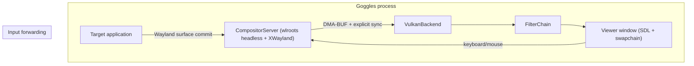

# Goggles Architecture

## Purpose

High-level overview of the Goggles codebase for maintainers. Start here to understand how the system is structured before diving into topic-specific docs.

## System Context

Goggles runs target applications inside a nested compositor and applies real-time shader effects before display.



## Module Overview

### `src/compositor/` - Compositor Server

**Responsibility:** Run target applications inside a nested Wayland compositor and export frames to the render backend.

| Component | Purpose |
|-----------|---------|
| `compositor_server.*` | wlroots headless compositor, surface management, frame export |

### `src/render/` - Render/Backend Integration

**Responsibility:** Import compositor frames, integrate the render-domain library, and present to
display.

| Component | Purpose |
|-----------|---------|
| `backend/` | Vulkan device, swapchain, compositor-frame import, presentation |

### `filter-chain/` - Render-Domain Library

**Responsibility:** Own RetroArch preset parsing, shader runtime behavior, pass-graph execution,
and render-domain assets behind the `GogglesFilterChain` package boundary.

**Key pattern:** Goggles hands imported frames to the filter-chain library, which applies
RetroArch-compatible shader presets (`.slangp` files) as a sequence of render passes.

See: [filter_chain_workflow.md](filter_chain_workflow.md), [retroarch.md](retroarch.md)

### `src/util/` - Utilities

**Responsibility:** Common infrastructure used across modules.

| Component | Purpose |
|-----------|---------|
| `error.hpp` | `tl::expected` error types |
| `logging.*` | spdlog wrapper |
| `config.*` | TOML configuration |
| `job_system.*` | Thread pool wrapper |
| `queues.hpp` | Lock-free SPSC queue |
| `unique_fd.hpp` | RAII file descriptor |

See: [threading.md](threading.md)

### `src/app/` - Application Entry

**Responsibility:** Initialize subsystems, run main loop, handle window events.

## Data Flow

```
1. Target app renders frame
   └─▶ Wayland surface commit to nested compositor

2. CompositorServer receives surface buffer
   └─▶ Extracts DMA-BUF + explicit sync fence
   └─▶ Passes to VulkanBackend as ExternalImageFrame

3. VulkanBackend imports DMA-BUF
   └─▶ Waits on acquire fence (explicit sync)
   └─▶ Creates Vulkan image for shader sampling

4. Filter-chain library processes frame
    └─▶ Pass 0 → Pass 1 → ... → Pass N (shader effects)

5. Final pass renders to swapchain
   └─▶ Signals release fence to compositor
   └─▶ Displayed on screen
```

## Key Design Decisions

| Decision | Rationale |
|----------|-----------|
| Nested compositor | Single-process architecture, captures any Wayland/X11 client |
| DMA-BUF sharing | GPU-to-GPU transfer without CPU copies |
| Explicit sync (wp_linux_drm_syncobj_v1) | GPU-to-GPU synchronization without CPU polling |
| RetroArch shader format | Leverage existing shader ecosystem |
| Single-threaded render loop | Simplicity; threading added only when profiling justifies |

## Topic Docs

- [Threading](threading.md) - Concurrency model, job system, SPSC queues
- [DMA-BUF Sharing](dmabuf_sharing.md) - Cross-process GPU buffer protocol
- [Filter Chain](filter_chain_workflow.md) - Multi-pass shader pipeline
- [RetroArch](retroarch.md) - Shader preset format and compatibility
- [Project Policies](project_policies.md) - Coding standards, error handling, ownership rules
