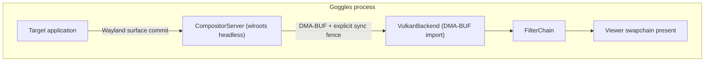
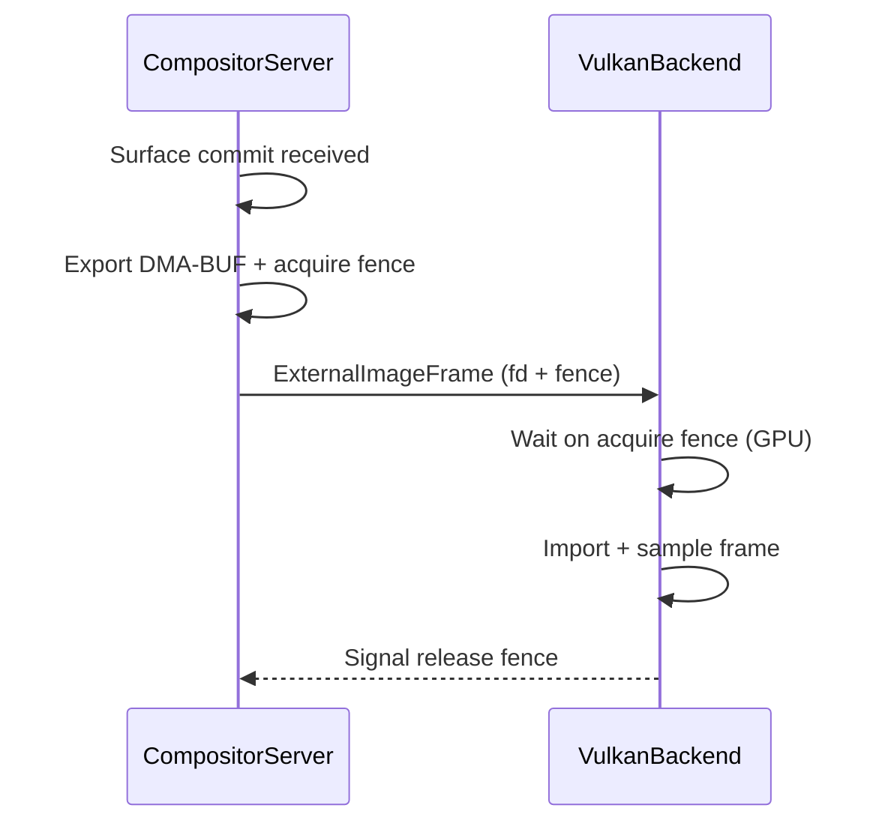

# DMA-BUF Compositor Frame Sharing

> **Components:** CompositorServer, VulkanBackend

This document explains how Goggles shares GPU textures from the nested compositor to the render backend using Linux DMA-BUF with DRM format modifiers and explicit sync (wp_linux_drm_syncobj_v1).

**Key Technologies:**
- **DMA-BUF:** Linux kernel mechanism for sharing GPU buffers between components
- **DRM Format Modifiers:** Metadata describing GPU-specific memory layouts (tiling, compression)
- **Explicit Sync (wp_linux_drm_syncobj_v1):** GPU-to-GPU synchronization without CPU polling

---

## 1. Architecture Overview

---

## 2. Why DRM Format Modifiers?

GPU memory is not always laid out linearly. Modern GPUs use various tiling patterns and compression schemes:

- **Linear:** Simple row-major layout
- **Tiled:** GPU-specific tile patterns (AMD 64KB tiles, Intel Y-tiling)
- **Compressed:** Delta Color Compression (DCC), etc.

When sharing GPU buffers, both sides must agree on the memory layout. DRM format modifiers are 64-bit values that encode the exact memory layout:

| Modifier Value | Meaning |
|----------------|---------|
| `0x0` | `DRM_FORMAT_MOD_LINEAR` (universal) |
| `0x200000020801b04` | AMD vendor-specific tiling |
| `0x100000000000001` | Intel Y-tiling |

By exchanging the modifier value, both sides can create compatible images.

---

## 3. Export/Import Flow

**Export (CompositorServer):**
1. wlroots allocates surface buffer with DRM format modifier support
2. Driver selects optimal modifier for the surface format
3. Surface buffer is exported as a DMA-BUF file descriptor
4. Compositor extracts format, dimensions, stride, and modifier from buffer metadata
5. Packages as `ExternalImageFrame` with acquire sync fence from `wp_linux_drm_syncobj_v1`

**Import (VulkanBackend):**
1. Receive `ExternalImageFrame` from compositor
2. Create image with explicit modifier (matching compositor's buffer layout)
3. Query dedicated allocation requirements (vendor modifiers often require it)
4. Import memory via `VkImportMemoryFdInfoKHR`
5. Bind memory and create image view for shader sampling
6. Wait on acquire fence before sampling

---

## 4. Required Vulkan Extensions

### Import Side (VulkanBackend)

| Extension | Purpose |
|-----------|---------|
| `VK_EXT_image_drm_format_modifier` | Create images with modifier tiling |
| `VK_KHR_image_format_list` | Required dependency for modifier ext |
| `VK_KHR_external_memory_fd` | Import memory from file descriptor |
| `VK_EXT_external_memory_dma_buf` | DMA-BUF handle type support |

---

## 5. Common Issues

| Error | Cause | Solution |
|-------|-------|----------|
| `VK_ERROR_INVALID_DRM_FORMAT_MODIFIER_PLANE_LAYOUT_EXT` | Invalid plane layout (e.g., `rowPitch = 0`) | Use explicit modifier with correct stride from compositor metadata. |
| `requiresDedicatedAllocation` validation error | Vendor modifiers require dedicated allocation | Query `VkMemoryDedicatedRequirements` and add `VkMemoryDedicatedAllocateInfo`. |
| Format doesn't support LINEAR tiling | Some formats incompatible with LINEAR + certain usage | Use DRM format modifiers instead of hardcoded LINEAR. |

---

## 6. Explicit Sync with wp_linux_drm_syncobj_v1

Explicit sync replaces CPU-polling synchronization with GPU-native fence passing.

### Why Explicit Sync?

Implicit sync relies on the kernel to track buffer usage, which can miss cross-driver or cross-queue dependencies. Explicit sync passes GPU timeline points directly:

- **Acquire fence:** Compositor signals when the surface buffer is ready for sampling
- **Release fence:** VulkanBackend signals when rendering is complete and the buffer can be reused

### Sync Protocol

| Fence | Signaled By | Waited On By | Purpose |
|-------|-------------|--------------|---------|
| Acquire fence | CompositorServer | VulkanBackend | Frame buffer ready for shader sampling |
| Release fence | VulkanBackend | CompositorServer | Render complete; buffer safe for reuse |

**Synchronization flow:**

---

## 7. References

- [VK_EXT_image_drm_format_modifier](https://registry.khronos.org/vulkan/specs/1.3-extensions/man/html/VK_EXT_image_drm_format_modifier.html)
- [Linux DRM Format Modifiers](https://docs.kernel.org/gpu/drm-kms.html#format-modifiers)
- [DMA-BUF Sharing](https://docs.kernel.org/driver-api/dma-buf.html)
- [wp_linux_drm_syncobj_v1](https://wayland.app/protocols/linux-drm-syncobj-v1)
