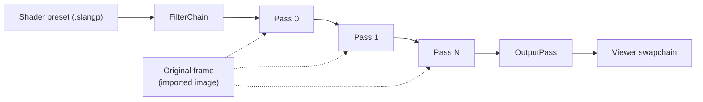
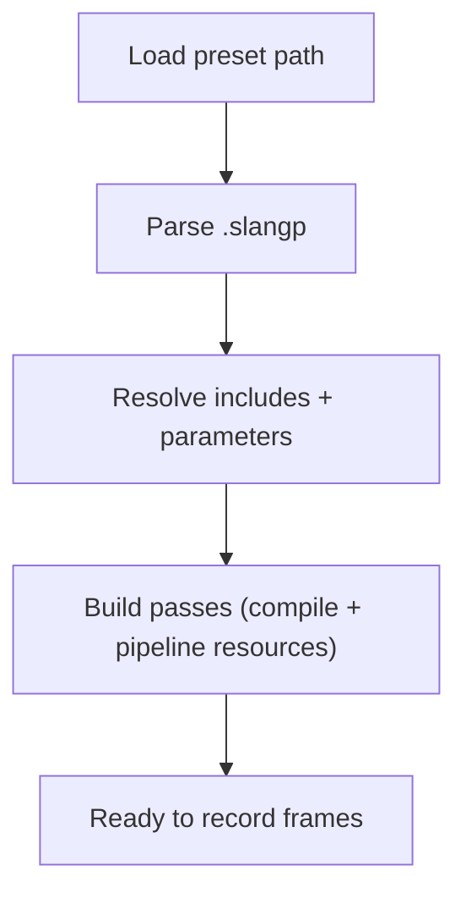

# Filter Chain Workflow

This document describes the filter-chain render-domain library that applies RetroArch shader presets
to captured frames.

## Overview

`filter-chain/` is a render-domain library that Goggles consumes through the
`GogglesFilterChain` package boundary. It transforms captured DMA-BUF images through a series of
shader passes before final presentation. It supports RetroArch `.slangp` preset files which define
multi-pass post-processing effects (CRT simulation, scanlines, etc.).

## Data Flow

Goggles-side responsibility stays in `src/render/backend/`: import compositor frames, hand them to
the filter-chain library, then present the final image.

### 1. Frame Capture

The render loop receives a captured frame as a DMA-BUF file descriptor. `VulkanBackend` imports this
into a Vulkan image with an associated image view, then passes that image into the filter-chain
runtime. This becomes the "Original" texture available to all shader passes.

### 2. Filter Chain Recording

Each frame, `FilterChain::record()` is called with:
- **Original image view**: The captured frame
- **Original extent**: Captured frame dimensions
- **Swapchain image view**: Target for final output
- **Viewport extent**: Display output dimensions
- **Frame index**: For double/triple buffering synchronization

### 3. Pass Execution

Passes execute sequentially. Each pass:

1. **Binds source texture**: Previous pass output (or Original for pass 0)
2. **Updates uniforms**: Size semantics, frame count, shader parameters
3. **Renders fullscreen quad**: Applies the shader effect
4. **Outputs to target**: Intermediate framebuffer or swapchain (final pass)

### 4. Synchronization

Image barriers ensure correct read-after-write ordering between passes:
- After each non-final pass: transition framebuffer from `COLOR_ATTACHMENT_OPTIMAL` to `SHADER_READ_ONLY_OPTIMAL`
- The final pass writes directly to the swapchain image handed in by Goggles

## Key Components

### FilterChain

Library entrypoint that orchestrates the shader preset:
- Loads and parses `.slangp` preset files
- Creates `FilterPass` instances for each shader pass
- Manages intermediate `Framebuffer` objects between passes
- Handles viewport resize by recreating size-dependent framebuffers

### FilterPass

Executes a single shader pass:
- Compiles Slang shaders via `ShaderRuntime`
- Creates Vulkan pipeline from reflection data (push constants, descriptors, vertex inputs)
- Updates descriptor sets with source/original textures
- Pushes semantic values (SourceSize, OutputSize, OriginalSize, FrameCount, parameters)

### OutputPass

Fallback pass when no shader preset is loaded:
- Simple blit from the imported image to the Goggles-provided swapchain target
- Uses basic vertex/fragment shaders
- Provides passthrough rendering

### Framebuffer

Intermediate render target between passes:
- Owns image, memory, and image view
- Format specified per-pass in preset (RGBA8, RGBA16F, etc.)
- Dimensions calculated from scale type (SOURCE, VIEWPORT, ABSOLUTE)

### SemanticBinder

Populates shader uniforms with RetroArch semantics:
- Size values as vec4: `[width, height, 1/width, 1/height]`
- Frame counter for animated effects
- MVP matrix for UBO (identity)

## Resource Management

### Sync Indices

Multiple descriptor sets are allocated (typically 2-3) to avoid GPU/CPU contention:
- `frame_index % num_sync_indices` selects the active set
- Each set has its own texture bindings updated per-frame
- Prevents modifying descriptors while GPU is reading them

### Descriptor Layout

Built dynamically from shader reflection:
- **Binding 0**: UBO (uniform buffer) for MVP matrix
- **Binding 1+**: Combined image samplers (Source, Original, etc.)

Stage flags are merged when both vertex and fragment shaders use a binding.

### Push Constants

Shader parameters are passed via push constants (not UBO) for per-frame updates:
- Standard semantics: SourceSize, OriginalSize, OutputSize, FrameCount
- User parameters: Shader-specific values from `#pragma parameter`

Values are written at reflection-reported offsets, not hardcoded struct layout.

## Preset Lifecycle

## Format Handling

### Intermediate Passes

Use format from preset configuration:
- `float_framebuffer = true` → R16G16B16A16_SFLOAT
- `srgb_framebuffer = true` → R8G8B8A8_SRGB
- Default → R8G8B8A8_UNORM

### Final Pass

Always uses the swapchain format (e.g., B8G8R8A8_UNORM) regardless of preset configuration. This ensures the pipeline format matches the render target.

## Resize Handling

When viewport dimensions change:

1. `FilterChain::handle_resize()` is called from the Goggles render/backend seam
2. Framebuffers with VIEWPORT scale type are resized
3. SOURCE-scaled framebuffers remain unchanged
4. Pipelines are not recreated (dynamic viewport/scissor)

## Error Recovery

If the source image format changes (e.g., HDR capture starts):

1. Swapchain is recreated with matching format
2. Filter chain is reinitialized
3. Preset is reloaded to recreate passes with new target format

This ensures pipeline format always matches the actual render target format.
