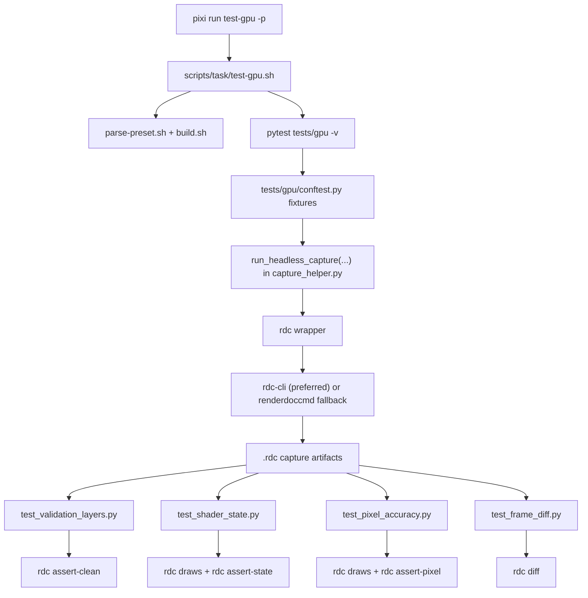

# GPU Test Framework Integration (Phase 3)

## Purpose

This document explains the Phase-3 GPU test integration for maintainers: what was introduced, what each component does, and how the pieces integrate into the existing Pixi/CMake/pytest workflow.

Use this as the operational and architectural reference for GPU validation tooling in this repository.

## Scope

This document covers:

- local RenderDoc package wiring and the `rdc` wrapper,
- task-level and pytest-level command contract gates,
- shared capture orchestration and GPU test modules,
- OpenSpec contract alignment,
- current known limitations and maintainer next steps.

## What Was Introduced

| Component | Path | What it does |
|-----------|------|--------------|
| Local RenderDoc package | `packages/renderdoc/recipe.yaml` | Installs RenderDoc into Pixi env and provides `rdc` command wrapper semantics used by tests. |
| GPU task entrypoint | `scripts/task/test-gpu.sh` | Runs GPU suite with explicit tool and command-contract preflight before `pytest`. |
| Shared pytest harness | `tests/gpu/conftest.py` | Resolves binaries, sets artifact directories, runs subprocesses, and mirrors command-contract preflight for direct `pytest` use. |
| Shared capture helper | `tests/gpu/capture_helper.py` | Builds/executes headless capture commands and standardizes capture error reporting. |
| GPU assertion suites | `tests/gpu/test_validation_layers.py`, `tests/gpu/test_shader_state.py`, `tests/gpu/test_pixel_accuracy.py`, `tests/gpu/test_frame_diff.py` | Validate clean validation output, shader state, pixel accuracy, and frame-diff behavior. |
| CTest registration for GPU pytest | `tests/gpu/CMakeLists.txt`, `tests/CMakeLists.txt` | Registers GPU suite as labeled CTest target (`gpu`) while generic `test` task excludes `gpu` label by default. |
| Spec contracts (OpenSpec delta) | `openspec/changes/2026-02-28-test-framework-phase3/specs/*` | Defines dependency and visual regression command contracts and expected behavior. |

## Integration Architecture



### Invocation Model

- Default project test path (`pixi run test -p <preset>`) excludes `gpu` label in `scripts/task/test.sh`.
- GPU path is intentionally explicit (`pixi run test-gpu`) to keep GPU/tooling constraints isolated from default CI-safe fast path.

## Package Boundary: `rdc` Wrapper and Command Semantics

The package boundary is where compatibility is normalized.

Implemented in `packages/renderdoc/recipe.yaml`:

1. Preserve backend binary as `renderdoccmd-real`.
2. Install an `rdc` wrapper script that:
   - translates `rdc capture --output <file>` to `renderdoccmd capture --capture-file <file>`,
   - strips the capture separator `--` used by test callsites,
   - routes `open|close|draws|assert-clean|assert-state|assert-pixel|diff` to `rdc-cli` when present,
   - otherwise falls back to backend command behavior (`renderdoccmd`).

This keeps command normalization at packaging boundary instead of spreading syntax translation across test modules.

## Task Entrypoint Guardrails (`scripts/task/test-gpu.sh`)

Before running pytest, the task enforces:

- `python -c "import renderdoc"` succeeds,
- `rdc --version` succeeds,
- required command-contract subcommands are available:
  - `assert-clean`
  - `assert-state`
  - `assert-pixel`
  - `diff`

If any command is missing, the task fails fast with explicit remediation guidance.

## Pytest Harness Guardrails (`tests/gpu/conftest.py`)

`gpu_preflight` mirrors task-level checks so direct pytest invocations remain consistent with task behavior.

Key responsibilities:

- detect/validate build preset,
- resolve required binaries (`goggles`, `quadrant_client`),
- verify `renderdoc` import and `rdc` availability,
- verify required `rdc` command contract,
- provide subprocess runner with timeout and diagnostics,
- allocate per-test artifact directory under `build/<preset>/tests/gpu-artifacts/<sanitized-test-nodeid>/`.

## Capture Helper Contract (`tests/gpu/capture_helper.py`)

`run_headless_capture(...)` is the shared capture primitive used across GPU tests.

Behavior:

- constructs app command (`goggles --headless ... -- <target>`),
- wraps it with `rdc capture --output ... -- <app>` command contract,
- executes subprocess with policy timeout,
- validates capture path (`.rdc`) and file existence,
- emits standardized failure context with:
  - `Capture path:`
  - `Command:`
  - `Exit code:`
  - captured `stdout`/`stderr` (when present).

## GPU Test Modules and Assertion Contracts

| Module | Primary command contract | Purpose |
|--------|--------------------------|---------|
| `tests/gpu/test_validation_layers.py` | `rdc assert-clean --min-severity HIGH` | Ensure deterministic captures are free of HIGH-severity validation issues. |
| `tests/gpu/test_shader_state.py` | `rdc draws --json`, `rdc assert-state` | Assert expected topology/state for shader-enabled render path. |
| `tests/gpu/test_pixel_accuracy.py` | `rdc draws --json`, `rdc assert-pixel` | Validate fixed-coordinate RGBA expectations within tolerance. |
| `tests/gpu/test_frame_diff.py` | `rdc diff ... --framebuffer --json --threshold 0 --diff-output ...` | Validate shader toggle/parameter/stability thresholds and generate diff artifacts on threshold violations. |

## OpenSpec Alignment

Phase-3 behavior is specified in:

- `openspec/changes/2026-02-28-test-framework-phase3/specs/dependency-management/spec.md`
- `openspec/changes/2026-02-28-test-framework-phase3/specs/visual-regression/spec.md`

These deltas define the expected command contracts and scenario-level behavior for GPU assertions and suite execution.

## External Command Semantics (Authoritative References)

These references explain why wrapper translation and command-contract checks exist:

- RenderDoc `renderdoccmd capture` uses `--capture-file` option:
  - https://github.com/baldurk/renderdoc/blob/d217893e06bd7f5bcf2d43fdfd1e38ce595468f7/renderdoccmd/renderdoccmd.cpp#L1619-L1624
  - https://github.com/baldurk/renderdoc/blob/d217893e06bd7f5bcf2d43fdfd1e38ce595468f7/renderdoccmd/renderdoccmd.cpp#L210-L213
- `rdc-cli` capture interface uses `--output` and maps it to `--capture-file` on backend fallback:
  - https://github.com/BANANASJIM/rdc-cli/blob/214666cb3d0ea12ad24f0cbc6226490b948798cc/src/rdc/commands/capture.py#L42-L47
  - https://github.com/BANANASJIM/rdc-cli/blob/214666cb3d0ea12ad24f0cbc6226490b948798cc/src/rdc/commands/capture.py#L269-L283
- `rdc-cli` command surface includes `open`, `draws`, `assert-*`, and `diff`:
  - https://github.com/BANANASJIM/rdc-cli/blob/214666cb3d0ea12ad24f0cbc6226490b948798cc/README.md#L179-L188
  - https://github.com/BANANASJIM/rdc-cli/blob/214666cb3d0ea12ad24f0cbc6226490b948798cc/src/rdc/cli.py#L92-L93
  - https://github.com/BANANASJIM/rdc-cli/blob/214666cb3d0ea12ad24f0cbc6226490b948798cc/src/rdc/cli.py#L99-L100
  - https://github.com/BANANASJIM/rdc-cli/blob/214666cb3d0ea12ad24f0cbc6226490b948798cc/src/rdc/cli.py#L128-L133

## Current State and Known Limitation

Current default Pixi environment has RenderDoc tooling but not `rdc-cli` command surface for `assert-*` and `diff`.

As a result, GPU suite entrypoints now fail fast by design when command contract is incomplete. This is intentional to avoid false-green runs caused by broad runtime skipping.

## Maintainer Verification Checklist

Use this sequence when touching GPU/RenderDoc integration code:

```bash
pixi install
pixi run rdc --version
pixi run rdc capture --output /tmp/goggles-probe.rdc -- /bin/true
pixi run rdc assert-clean --help
pixi run test-gpu -p test
pixi run test -p test
pixi run build -p test
```

Interpretation:

- If `assert-clean`/`assert-state`/`assert-pixel`/`diff` are unavailable, `test-gpu` should fail fast with explicit missing-command output.
- Default non-GPU test/build workflows should remain unaffected.

## Next Integration Step

To enable full contract execution (instead of fail-fast preflight), add and pin `rdc-cli` in the Pixi environment so wrapper-dispatched `open/draws/assert-*/diff` commands are available end-to-end.
